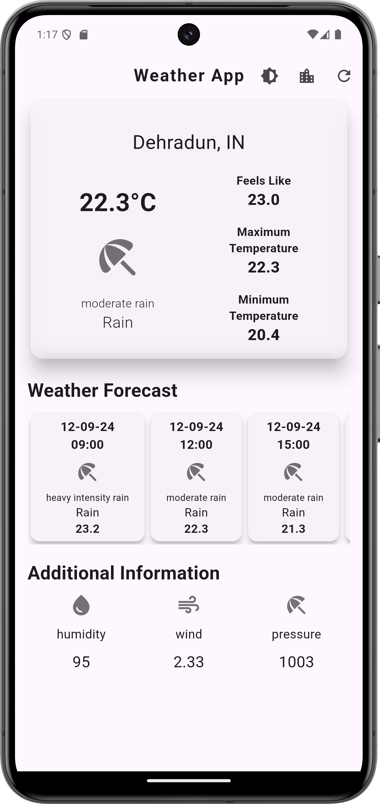

# Weather App

A Flutter-based weather application that provides real-time weather updates for various cities, including detailed forecasts and dynamic theme switching between light and dark modes.

## Features

- Fetch weather data from OpenWeatherMap API.
- Search for cities to get current weather information.
- Dynamic theme switching (light/dark mode).
- Real-time weather updates with forecast information in 3-hour intervals.
- Displays weather icons corresponding to weather conditions.
- Handles city search functionality with a list of Indian cities.
- Caches the latest weather forecast for quick access.

## Technologies Used

- **Flutter**: Cross-platform app development.
- **Dart**: Programming language for Flutter.
- **OpenWeatherMap API**: For fetching weather data.
- **Firebase**: (If applicable, for linking and other integrations).
- **intl**: Package for handling internationalization.

## Screenshots

### Android

<div style="display: flex;">
    
    
</div>

### Windows

#### Light Mode


#### Dark Mode


### Web

#### Light Mode


#### Dark Mode


## Installation

### Prerequisites

- Install [Flutter SDK](https://flutter.dev/docs/get-started/install).
- Android Studio or Xcode for iOS development.
- Ensure you have set up your environment for [Android](https://flutter.dev/docs/get-started/install) or [iOS](https://flutter.dev/docs/get-started/install/macos) development.

### Steps

1. Clone the repository:
   ```bash
   git clone https://github.com/Sarverjii/Weather_App.git
   cd weather_app
   ```
2. Install dependencies:
   ```bash
   flutter pub get
   ```
3. Run the app:

   ```bash
   flutter run
   ```

## API Integration

This app uses the OpenWeatherMap API to retrieve weather information. Ensure you have an API key from OpenWeatherMap.

To use your own API key, replace myApiId in the api_class class located in the lib/API related Stuff directory:

```dart
final res = await http.get(Uri.parse("https://api.openweathermap.org/data/2.5/?q=$cityName,$countryCode&APPID=$myApiId"));
```

##Future Enhancements

- Add a custom splash screen.
- Change the app icon.
- Add more cities and locations globally.
